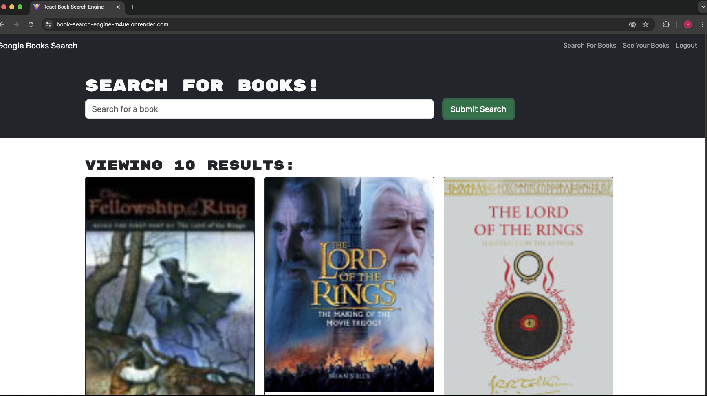

# Book Search Engine

A MERN stack application that allows users to search for books using the Google Books API and save their favorite books to their profile.

## Features

- User authentication (signup/login)
- Search for books using the Google Books API
- Save books to your profile
- View your saved books
- Remove books from your saved collection
- Responsive design for desktop and mobile

## Technologies Used

- **Frontend:**
  - React with TypeScript
  - Apollo Client for GraphQL
  - Bootstrap for styling
  - React Router for navigation

- **Backend:**
  - Node.js with Express
  - GraphQL API
  - MongoDB with Mongoose
  - JWT Authentication

- **APIs:**
  - Google Books API
  - GraphQL API

## Live Demo

Visit the deployed application at: https://book-search-engine-m4ue.onrender.com

## Local Development Setup

1. Clone the repository:
   ```bash
   git clone https://github.com/eoreilly0906/Book-Search-Engine.git
   cd Book-Search-Engine
   ```

2. Install dependencies:
   ```bash
   # Install server dependencies
   cd server
   npm install

   # Install client dependencies
   cd ../client
   npm install
   ```

3. Set up environment variables:
   Create a `.env` file in the server directory with:
   ```
   MONGODB_URI=your_mongodb_connection_string
   JWT_SECRET=your_jwt_secret
   ```

4. Start the development servers:
   ```bash
   # Start the server (from server directory)
   npm run dev

   # Start the client (from client directory)
   npm run dev
   ```

## Project Structure

```
Book-Search-Engine/
├── client/                 # React frontend
│   ├── src/
│   │   ├── components/    # Reusable components
│   │   ├── pages/        # Page components
│   │   ├── utils/        # Utility functions
│   │   └── App.tsx       # Main App component
│   └── package.json
├── server/                # Node.js backend
│   ├── src/
│   │   ├── config/       # Database configuration
│   │   ├── models/       # Mongoose models
│   │   ├── schemas/      # GraphQL schemas
│   │   └── server.ts     # Express server setup
│   └── package.json
└── README.md
```

## API Documentation

### GraphQL Queries

- `me`: Get current user's profile and saved books
- `users`: Get all users (admin only)

### GraphQL Mutations

- `addUser`: Create a new user account
- `login`: Authenticate user
- `saveBook`: Save a book to user's profile
- `removeBook`: Remove a book from user's profile

## Screenshots

### Home Page


### Search Page


### Saving Books


### Saved Books Page


## Resources

- [Google Books API Documentation](https://developers.google.com/books/docs/v1/using)
- [Apollo Client Documentation](https://www.apollographql.com/docs/react/)
- [Mongoose Documentation](https://mongoosejs.com/docs/)
- [Express Documentation](https://expressjs.com/)
- [React Documentation](https://reactjs.org/)

## License

This project is licensed under the MIT License.

## Author

Edward O'Reilly
- GitHub: [eoreilly0906](https://github.com/eoreilly0906)

